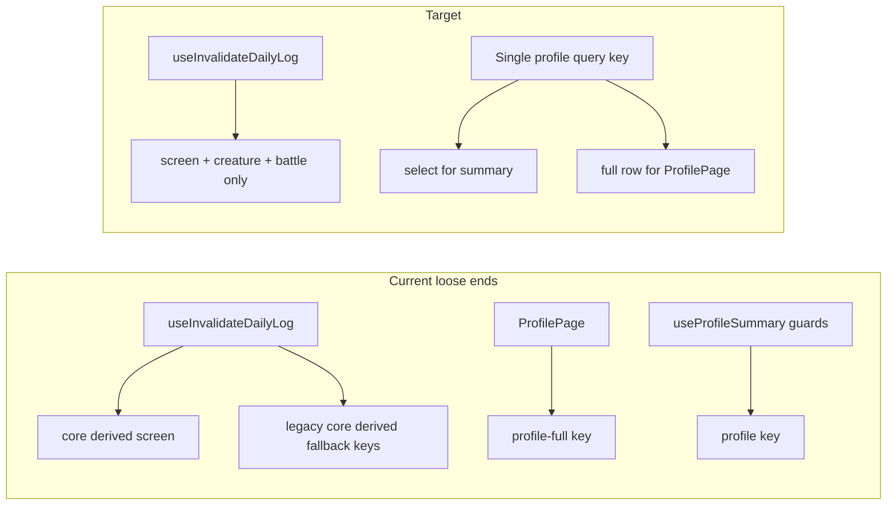

# Foundation hardening — loose ends

## Context (verified in repo)

- [`useLatestFallbackMetrics`](src/features/logging/useLatestFallbackMetrics.ts) is **never imported** elsewhere; latest habit/creature for the log now come from [`get_daily_log_screen_payload`](src/features/logging/useDailyLogScreen.ts) / [`dailyLogScreenPayload`](src/features/logging/dailyLogScreenPayload.ts).
- [`useDailyLogCore`](src/features/logging/useDailyLogCore.ts) and [`useDailyLogDerived`](src/features/logging/useDailyLogDerived.ts) are **not referenced** from pages or other features (only self-contained).
- [`useInvalidateDailyLog`](src/features/logging/useDailyLog.ts) still invalidates `DAILY_LOG_CORE`, `DAILY_LOG_DERIVED`, and `LATEST_FALLBACK_METRICS` keys on every log change — these are **legacy no-ops** if nothing subscribes.
- [`useProfileSummary`](src/features/profile/useProfileSummary.ts) and [`ProfilePage`](src/pages/app/ProfilePage.tsx) use **different query keys** and two network shapes for the same `profiles` row (summary vs `PROFILE_FULL_SELECT`).
- [`useFoodSourceMap`](src/features/logging/useFoodSources.ts) is **exported but unused** anywhere in `src` (only definition site).
- [`useInvalidateProductQueries`](src/features/logging/queryInvalidation.ts) still does a **broad** `queryKeys.foodSources.prefix()` invalidation for any product-mutating path.

---

## 1) Dead hooks and slimmer invalidation (high value, low risk)

- **Remove** (or, if you prefer a softer step, re-export from a `deprecated.ts` and delete in a follow-up): `useLatestFallbackMetrics.ts`, `useDailyLogCore.ts`, `useDailyLogDerived.ts`.
- **Trim** [`useInvalidateDailyLog`](src/features/logging/useDailyLog.ts): stop invalidating `DAILY_LOG_CORE`, `DAILY_LOG_DERIVED`, and `LATEST_FALLBACK_METRICS` unless a test or external consumer still needs them. After a repo-wide grep, **remove exported constants** that become unused, or keep constants only for tests that assert invalidation.
- **Update** any docs that still describe the old three-hook daily log (e.g. [`docs/`](docs/) references in comments like [`dailyLogScreenPayload.ts`](src/features/logging/dailyLogScreenPayload.ts) line ~131) so they point at the screen RPC.
- **Run** tests; adjust mocks that reference removed modules.

---

## 2) Unify profile caching (medium value)

**Goal:** One `profiles` fetch per “logical” need, one primary query key, guards and profile settings stay consistent.

- Introduce a **single** query key for the full row, e.g. `queryKeys.profile.detail(userId)` (or rename `full` to `detail` and deprecate `summary`).
- **Single `queryFn`**: `PROFILE_FULL_SELECT` (already in [`supabaseSelect`](src/lib/supabaseSelect.ts)), return typed `ProfileRow` (with existing `as unknown` cast pattern if needed).
- **Refactor** `useProfileSummary` to `useQuery({ queryKey, queryFn, select: (row) => ({ timezone, calorieTarget, onboardingCompletedAt }) })` so guards/arena/creature only **subscribe to the subset** but share the same cache entry as the full profile query.
- **Refactor** `ProfilePage` to use the **same** `queryKey` + `queryFn` (no `select`, or `select: identity` for the full row). On save, invalidate the **one** key (drop double `summary` + `full` invalidation in [`ProfilePage` onSubmit](src/pages/app/ProfilePage.tsx)).
- **Update** [`queryKeys`](src/lib/queryKeys.ts) comments so “summary” vs “full” becomes “detail + optional select”.

---

## 3) `useFoodSourceMap` (small, explicit decision)

- **Option A (recommended for minimal surface):** Remove `useFoodSourceMap` if there is no near-term batch resolution use case, and add a one-line note in [`useFoodSources.ts`](src/features/logging/useFoodSources.ts) that callers should use `listUserProductsPage` / RPCs for bulk cases.
- **Option B:** Wire it into the one place that would benefit (e.g. meal item hydration if you reintroduce N+1 resolution). Only choose if you have a concrete callsite in mind.

---

## 4) Narrow `useInvalidateProductQueries` (medium effort, high precision)

- **Audit** call sites: [`MealSheet`](src/features/logging/MealSheet.tsx), [`SlotCard`](src/features/logging/meal-slots/SlotCard.tsx), [`FoodDetailPage`](src/pages/app/FoodDetailPage.tsx), [`InlineQuickAdd`](src/features/logging/InlineQuickAdd.tsx), [`LoggedMealRow`](src/features/logging/meal-slots/LoggedMealRow.tsx).
- **Split** into two (or more) functions in [`queryInvalidation.ts`](src/features/logging/queryInvalidation.ts), for example:
  - `useInvalidateUserFoodLibrary()` — `my-food-products`, `my-food-product`, legacy `products` if still needed
  - `useInvalidateFoodSourceLists()` — `food-sources` subtree (or finer: `recent` + `frequent` + `search` if you can classify the mutation)
- Map each call site to the **smallest** invalidation that keeps UI correct (e.g. logging a meal may only need `recent` + `frequent`, not `search` + `map`).

---

## 5) Optional: server batch operations (larger, pick by pain)

- **Import:** Replace sequential `insertSimpleProduct` in [`foodImport.ts`](src/features/foods/foodImport.ts) with a **batch RPC** or **chunked** client transactions only if import latency is a product issue; otherwise document as future work.
- **Clear slot:** [`SlotCard` `handleClearAll`](src/features/logging/meal-slots/SlotCard.tsx) already uses parallel `deleteMeal`; a **`delete_meals` RPC** is optional and adds migration + RLS review — only if you see rate limits or want atomicity.
- **Verify** [`046_get_composite_products_batch.sql`](supabase/migrations/046_get_composite_products_batch.sql) is applied in all environments (export path depends on it).

---

## 6) Optional polish (from architecture reviews)

- **Lazy-load** the daily log route in [`src/app/router/index.tsx`](src/app/router/index.tsx) to keep the main bundle smaller (if acceptable UX tradeoff: tiny loading flash on first `/app` visit).
- **Guards:** Replace `return null` while auth/profile load with a small [`RouterLoadingFallback`](src/app/router/RouterLoadingFallback.tsx) in [`guards.tsx`](src/app/router/guards.tsx) if blank flashes matter.

---

## Suggested order

1. Remove dead hooks + trim `useInvalidateDailyLog` (quick win, clarifies cache behavior).
2. Unify profile query (fixes duplicate fetches and simplifies mental model).
3. `useFoodSourceMap` remove or wire.
4. Scoped product invalidation (incremental, test after each call site).
5. Optional server / router polish as time allows.

No edits to the roadmap plan file itself.
